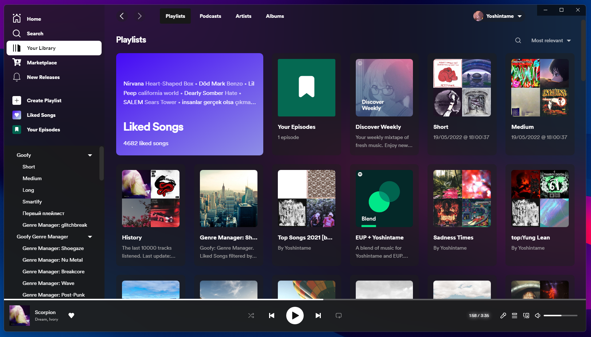

## Note for development
<code>spicetify watch -s</code> - live css

<code>spicetify enable-devtools </code> 

# Examples
## Spotify themes
[Bloom](https://github.com/nimsandu/spicetify-bloom?utm_source=pocket_mylist)

[Retroblur](https://github.com/Motschen/Retroblur?utm_source=pocket_mylist)

[Fluent](https://github.com/williamckha/spicetify-fluent?utm_source=pocket_mylist)

## Other apps
[Stylophone - music player](https://github.com/Difegue/Stylophone)

[Mustastic - music player](https://github.com/TyJOrtiz/Mustastic)

[Quarrel - discord client](https://github.com/UWPCommunity/Quarrel)

Unigram

Windows Settings

## Other tools

[Spotify Fluent (Bloom theme) - auto install](https://github.com/Fluent-Modded-Spotify/App?utm_source=pocket_mylist) 

[MicaForEveryone](https://github.com/MicaForEveryone/MicaForEveryone)

# Concepts
In screenshots folder

# Current state

